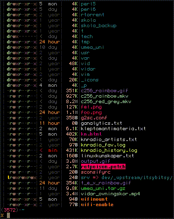

# vimcat

Vim has an amazing syntax highlighting engine that offers unlimited
configurability. We can fully utilize it and all its features straight
in the terminal:

vimcat uses the AnsiHighlight vim plugin by Matthew Wozniski to do its
magic. No need to install anything extra, the plugin is inlined in the
bash script to do its magic.
